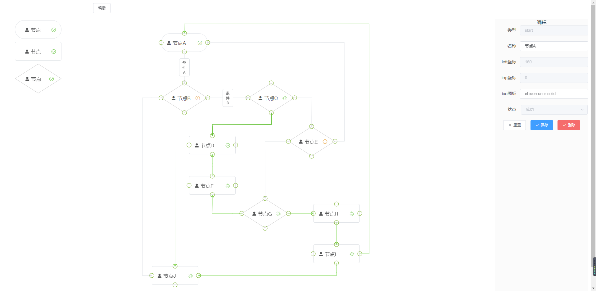
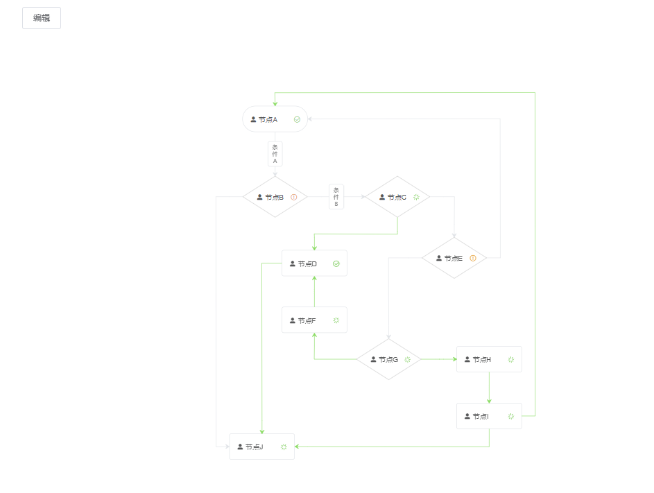

> notice: vue流程图绘制

</img>
</img>

## 特性 / Features

* 可拖拽编辑和缩放流程图
* 流程图节点拖拽新增、删除、修改
* 流程节点连线连接、删除、修改

### 前端部分：Vue.js

#### Project setup

npm install

#### Compiles and hot-reloads for development

npm run dev

## 鸣谢 / Thanks
本项目使用了 Vue.js 及以下第三方库：

* [jsplumb / jsplumb](https://github.com/jsplumb/jsplumb)
* [SortableJS / Vue.Draggable](https://github.com/SortableJS/Vue.Draggable)

## LICENSE

MIT
